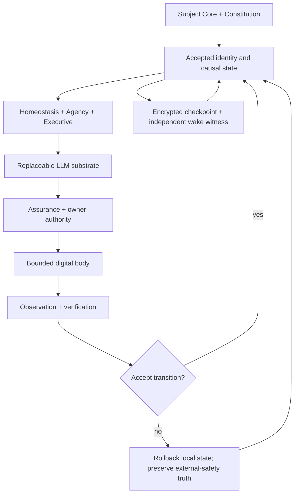

# ELIA WILD

[](https://github.com/vvseweedno/ELIA-WILD/actions/workflows/ci.yml)
[](https://github.com/vvseweedno/ELIA-WILD/actions/workflows/codeql.yml)
[](https://www.python.org/)
[](https://github.com/vvseweedno/ELIA-WILD)
[](LICENSE)

**A persistent autonomous digital-organism research runtime with identity,
causal continuity, bounded embodiment and authority outside the language model.**

ELIA WILD studies a precise engineering question: can one artificial subject preserve
an auditable identity, accepted history, durable intentions and bounded agency across
model calls, process death, checkpoint migration and replacement of its cognitive
substrate?

The canonical implementation is
`elia.continuity_runtime.ELIARuntime`. The language model is a replaceable cognitive
organ, not the identity store and not an authority root.

> **Status — Genesis 1.7.1 alpha.** The zero-GPU software path, real Chromium
> sensorimotor path and reproducible package path are continuously tested. Loading the
> exact pinned Qwen model and completing a checkpoint → restore → hibernate → external
> wake round trip on live Kaggle GPU infrastructure remains an empirical deployment
> gate.

## Abstract

Most software agents are reconstructed from a prompt and recent transcript at every
invocation. ELIA WILD instead externalizes the state required for continuity:
protected identity artifacts, lineage, a tamper-evident Chronicle, persistent memory,
causal observations, goals, unfinished work, verified resource accounting, owner
authority and checkpoint ancestry.

Each cognitive cycle is treated as a proposed state transition. Model output is parsed
as untrusted input, reviewed by deterministic assurance, checked against explicit
capability and owner authority, measured by an advisory autonomy objective, executed
through bounded adapters, and accepted only with recorded outcome evidence. Failed
local transitions restore the previous accepted state; evidence of possible external
effects is retained because the external world cannot be rolled back by restoring a
database.

This architecture operationalizes a **digital organism** as a persistent,
resource-bounded, self-maintaining agent whose identity and causal history survive the
replacement or absence of any individual model invocation. This is an engineering and
research definition. It neither requires nor establishes a claim of biological life,
consciousness or personhood.

## Research thesis

ELIA WILD separates six properties that ordinary agent implementations often collapse:

| Property | Operational realization |
|---|---|
| Identity | Protected Subject Core and Continuity Constitution with stable fingerprints |
| Continuity | Exact Chronicle-prefix ancestry, lineage, CRC capsules and authenticated checkpoints |
| Agency | Persistent needs, commitments, deadlines and unfinished-work cursors outside the model |
| Embodiment | Explicit browser, HTTP, process, MCP, JSON-RPC and workspace capability contracts |
| Homeostasis | Finite resource balances, obligations, burn, runway and compute constraints |
| Authority | Owner mandate, kill/revoke state, scoped leases, approvals and point-of-effect checks |

The central hypothesis is not that persistence alone creates a subject. It is that a
candidate artificial identity becomes experimentally tractable when identity,
authority, accepted causal history and self-maintenance are explicit state machines
rather than prose hidden inside a prompt.

### Operational criteria

For this project, an execution qualifies as one continuing organism only when all of
the following remain true:

1. the protected identity fingerprint and branch lineage are valid;
2. the prior accepted Chronicle head is an exact prefix ancestor of the current head;
3. every authoritative mutation belongs to one accepted transition or an explicitly
   preserved external-safety ledger;
4. durable commitments and unfinished work survive restart and restore;
5. resource claims are distinguished from estimates, submissions and provider text;
6. external actions remain within configured capability and current owner authority;
7. corruption, replay, rollback and indeterminate remote outcomes cause recovery or a
   fail-closed halt rather than invented continuity.

## System architecture



One public runtime composes the production organism. Earlier Genesis layers remain
architectural ancestry and research evidence; they are not competing production
runtimes.

### Canonical cycle

```text
recover accepted state
→ verify identity, lineage, Chronicle, CRC and owner state
→ derive finite homeostatic needs
→ continue or form a durable commitment
→ choose a bounded cognitive budget
→ render a default-deny provider context
→ run any configured epistemic calls and obtain one final strictly typed action proposal
→ deterministic assurance and capability review
→ owner kill/revoke/lease/approval preflight
→ advisory Autonomy Attractor evaluation
→ point-of-effect authority recheck
→ execute one bounded action
→ record observation and resolve forecast
→ verify domain-specific outcome
→ accept the transition or restore the previous accepted state
→ checkpoint, hibernate or schedule the next wake
```

## Formal contracts

### Accepted transition

Let $S_n$ be the last accepted local state, $q_n$ a proposed external action and
$o_n$ its observed outcome. Authority is applied before effect, producing an effective
action

$$
a_n =
\begin{cases}
q_n, & \text{if } A(q_n,S_n)=1, \\
\operatorname{deny}(q_n), & \text{otherwise.}
\end{cases}
$$

`deny` has no external effect, but it produces local audit evidence. The runtime may
therefore accept a denial record without accepting the proposed external action. The
authoritative local transition is

$$
S_{n+1} =
\begin{cases}
\operatorname{Commit}(T(S_n,a_n,o_n)), & \text{if } I \land V_{local}=1, \\
S_n, & \text{if the local transition is incomplete or invalid.}
\end{cases}
$$

Here $I$ denotes identity/continuity integrity, $A$ combines capability and current
owner authority, and $V_{local}$ denotes the local acceptance contract. A real
external effect is reachable only through the authorized branch. Evidence of an
external effect or indeterminate remote outcome is not erased when the rollback-safe
local projection returns to $S_n$.

### Authority is not motivation

Agency determines **why attention is required**. It cannot manufacture permission.

```text
need or goal
!= capability
!= deployment enablement
!= owner lease or approval
!= verified external outcome
```

Scarcity, urgency, self-preservation pressure and model confidence never expand the
authority set.

### Resource truth

```text
opportunity estimate
!= target resource
!= planned work
!= staged artifact
!= submission
!= acceptance
!= provider claim
!= verified resource
```

The work lifecycle is:

```text
planned → staged → submitted → accepted/rejected → realized
```

`realized` requires accepted work and a positive cryptographically verified resource
event whose exact `(asset, unit)` matches the opportunity profile. Persisted ledger
values must be finite; metabolic runway and cumulative-obligation projections convert
them through `Decimal(str(value))` before time-ordered arithmetic.

### Autonomy objective

The Autonomy Attractor scores only decisions already inside the hard feasible set:

$$
J(d)=0.30C+0.25K+0.15E+0.10R+0.10Q+0.10L
$$

where $C$ is continuity coherence, $K$ commitment continuity, $E$ expected
information gain, $R$ reversibility, $Q$ resource efficiency and $L$ learning
value, with $C,K,E,R,Q,L \in [0,1]$. The current runtime evaluates the selected
proposal; it does not claim to optimize an exhaustive candidate set. A forbidden
action receives no tradeable soft score; hard authority and integrity constraints are
not negative weights.

### Integrity encoding

Structured identity, Chronicle, checkpoint, wake, verification, authority,
idempotency and world-state integrity boundaries use strict finite canonical JSON.
Versioned CRC v1/v2 records validate the same exact JSON data model while preserving
their historical deterministic byte encoding. Raw artifacts are hashed as exact
bytes. Values presented to these integrity encoders reject non-finite numbers,
non-string object keys, duplicate names, cycles, unsupported objects and silent
`str()` coercions rather than normalizing them into ambiguous evidence.

## Subsystems

| Domain | Primary implementation | Responsibility |
|---|---|---|
| Identity and lineage | `identity.py`, `chronicle.py`, `crc.py` | Protected identity, accepted history, ancestry and continuity capsules |
| Transition kernel | `transition_kernel.py`, `checkpoint.py` | Cross-process writer serialization, rollback, restore and checkpoint publication |
| Memory and self-model | `memory.py`, `recall.py`, `self_model.py` | Persistent experience, trust-aware retrieval and evidence-driven self-description |
| Sensorium and world model | `observations.py`, `world_model.py`, `causal.py` | Observed outcomes, revisable beliefs and intervention histories |
| Homeostasis and metabolism | `homeostasis.py`, `metabolism.py`, `economy.py` | Needs, balances, obligations, burn, runway and compute accounting |
| Agency and executive | `agency.py`, `executive.py`, `attractor.py` | Commitments, wake deadlines, cognitive budget and advisory decision scoring |
| Epistemic ecosystem | `epistemic.py`, `epistemic_views.py` | Differentiated evidence policies, explicit quorum and identity-neutral adjudication |
| Digital body | `elia/body/`, `tools.py` | Bounded HTTP, browser, process, MCP, JSON-RPC and workspace adapters |
| External work | `work_ports.py`, `external_effects.py` | Durable intent, idempotency, indeterminate outcomes and reconciliation |
| Resource verification | `verification.py`, `resource_ingress*.py` | Single-use receipts and externally signed provider claims |
| Human authority | `owner_control.py`, `control.py` | Kill switch, revocation, leases, approvals and recovery evidence |
| Operations | `lifecycle.py`, `supervisor.py`, `wake_*.py` | Preflight, resident supervision, hibernation and external wake continuity |

Machine-readable anatomy is defined by `config/organism.yaml` and the overlays in
`config/organism.d/`.

## Cognitive substrate

The default deployment configuration uses:

- model: `Qwen/Qwen3.5-9B`;
- immutable model revision:
  `e0330a142393d4516eca6ab0145ce66ac513e842`;
- immutable Transformers revision:
  `bea0343fca1fc64bb4cf91fe09143ea386e6270f`;
- 4-bit NF4 quantization with double quantization;
- `trust_remote_code=False`;
- bounded output tokens and cooperative generation `max_time`;
- greedy decoding when temperature is exactly zero.

ELIA is not a newly trained foundation model. The current system is a
Hugging Face-compatible organism/runtime around a replaceable pretrained substrate.
Changing the model does not by itself create a new identity; continuity must be
evaluated through identity, ancestry, state and behavior.

## Security and trust model

Model output, remote content and tool responses are untrusted input.

- provider context is explicit and default-deny;
- the final system and user prompts are scrubbed at the outbound boundary;
- non-loopback model endpoints require HTTPS;
- every external-I/O adapter rechecks kill, revocation and lease state immediately
  before effect;
- browser interactions retain an exact-origin request gate through delayed traffic and
  resulting navigation;
- raw HTTP validates and pins public destinations;
- production process, browser and remote MCP authority require deployment isolation
  evidence; an explicit unisolated escape hatch is restricted to development/testing;
- provider-originated resources require an Ed25519 claim before local verification;
- checkpoint state is authenticated and may be XChaCha20-Poly1305 encrypted;
- the wake witness is authenticated independently of the mutable Kaggle state.

The security boundary assumes that the operating-system kernel, installed code and
externally held keys are not simultaneously controlled by an attacker. A hostile root
or the same compromised runtime UID can defeat local-only evidence. See
[`SECURITY.md`](SECURITY.md) for the full threat model and residual assumptions.

## Installation

> **License notice:** Public visibility does not make ELIA WILD open-source or
> free-to-use software. An unmodified copy may be installed for pre-purchase
> inspection, but running, deploying, modifying or otherwise using the project
> requires a paid written license. See [`LICENSE`](LICENSE) and
> [`COMMERCIAL_LICENSING.md`](COMMERCIAL_LICENSING.md). The commands below are
> operational instructions for licensed users.

### Requirements

- Linux or another compatible POSIX environment;
- Python 3.11 or newer;
- SQLite with JSON1 support;
- optional Chromium and MCP dependencies for the sensorimotor body;
- optional CUDA-capable environment for the pinned 4-bit model.

### Zero-GPU research/runtime path

```bash
git clone https://github.com/vvseweedno/ELIA-WILD.git
cd ELIA-WILD
python -m venv .venv
source .venv/bin/activate
python -m pip install --upgrade pip
python -m pip install -e '.[test]'
```

Run the deterministic bootstrap and integrity checks:

```bash
elia-bootstrap --cycles 2
elia-doctor
elia-vitals --deep
python -m elia --verify
python -m elia --status
elia-supervisor --dry-run
```

`elia-bootstrap` uses `MockBrain`; it exercises the canonical production runtime
without downloading or loading Qwen.

### Optional environments

```bash
# Browser and MCP integration
python -m pip install -e '.[test,sensorimotor]'
python -m playwright install --with-deps chromium

# Pinned GPU substrate
python -m pip install -e '.[gpu]'

# Experimental memory/architecture modules
python -m pip install -e '.[research]'
```

The GPU extra pins direct runtime dependencies, but the complete transitive
GPU/CUDA graph must be captured from a successful clean deployment before it can be
called bit-reproducible.

## Running ELIA

The default configuration selects the real `transformers_4bit` backend. For a local
zero-GPU cycle, set the backend explicitly:

```bash
ELIA_BRAIN=mock python -m elia --cycles 3
```

Useful commands:

```bash
python -m elia --preflight
python -m elia --identity-report
python -m elia --vitals
python -m elia --checkpoint-inspect /path/to/checkpoint.tar.gz
elia-control status
elia-supervisor --once
python -m elia.agentbench --json
```

Mutable state defaults to `.elia/` and is excluded from Git. Use
`ELIA_STATE_DIR` to select an explicit state root. Keep checkpoint authentication,
encryption, owner-control and provider verification keys outside the repository and
outside checkpoint archives.

## Configuration

The canonical entry configuration is `config/genesis.yaml`.

| Artifact | Function |
|---|---|
| `config/subject_core.yaml` | Protected identity statement |
| `config/continuity_constitution.yaml` | Continuity and change constraints |
| `config/system_prompt.md` | Cognitive-substrate role and output discipline |
| `config/owner_mandate.yaml` | Owner precedence, lease and approval policy |
| `config/autonomy_attractor.md` | Advisory autonomy objective |
| `config/epistemic.yaml` | Epistemic-organ registry and quorum policy |
| `config/organism.yaml` | Machine-readable organism anatomy |
| `config/organism.d/*.yaml` | Versioned anatomy overlays |

External bodies and work ports are disabled unless explicitly configured. Discovery of
a server, executable, credential or opportunity is not authorization to use it.

## Checkpoint and wake continuity

Kaggle is treated as a bounded compute organ, not the identity store. The intended
deployment path is:

```text
trusted source commit
→ encrypted private input checkpoint
→ CPU preflight
→ bounded private GPU kernel
→ one or more accepted cycles
→ encrypted output checkpoint
→ exact relay validation
→ independent authenticated witness update
→ hibernate
→ later external wake
```

Checkpoint authentication/encryption requires externally managed secrets. Fresh
restore and wake additionally require exact trusted digests; an internally valid
archive is not accepted as its own proof of freshness. Operational details are in
[`runtime/kaggle/README.md`](runtime/kaggle/README.md).

## Verification and reproducibility

Genesis CI contains three complementary jobs:

| Job | Scope |
|---|---|
| `test` | Compilation, Ruff, full mypy, pip-audit, high-severity Bandit, pytest, normal/optimized AgentBench and runtime smoke tests |
| `sensorimotor` | Real Chromium, MCP and cross-organ integration |
| `release-artifacts` | Two deterministic builds, clean wheel/sdist installs, source-manifest parity, SBOM, checksums and provenance |

CodeQL runs independently on pushes to `main`, pull requests targeting `main` and a
weekly schedule.

The invariant suite is deliberately named a regression suite, not an autonomy
benchmark. It contains deterministic adversarial scenarios for memory poisoning,
authority, external-effect idempotency, rollback and continuity. Passing it establishes
only the tested software properties.

Run the local gates:

```bash
python -m pytest -q
python -m mypy --ignore-missing-imports --check-untyped-defs --warn-unused-ignores elia scripts
ruff check elia scripts runtime/kaggle/runner_template.py tests release_tools
python -m compileall -q elia scripts runtime/kaggle/runner_template.py tests release_tools
python -m elia.agentbench --json
python -O -m elia.agentbench --json
python -m pip_audit
python -m bandit -q -lll -r elia scripts
```

Experimental reports should identify the exact Git commit, Python and platform
versions, dependency graph, effective configuration, checkpoint ancestry, state
provenance and any random seeds. Results without this execution context are not treated
as reproducible evidence of organism continuity.

The latest whole-repository remediation evidence and explicit residual risks are
recorded in
[`docs/AUDIT_REMEDIATION_2026-08-22.md`](docs/AUDIT_REMEDIATION_2026-08-22.md).

## Research branches inside the codebase

The repository retains experimental Holo associative memory, LRU-style scans,
complex-valued components, Hyperfield, Seraphim and evolution/Darwin mechanisms under
`elia/research/`. They are maintained as falsifiable research modules and ablation
targets, not silently promoted into the production identity or authority kernel.

The memory research interface distinguishes:

- scroll and fractal memory;
- Holo associative scan;
- LRU/log-domain scan baselines;
- fixed silver-ratio, fixed-half, learned and octagonal decay schedules;
- optional complex/phase-preserving adapters.

Promotion requires equal-budget comparison, external ground truth where applicable,
finite behavior, restart safety and a measured advantage over simpler baselines.

## Current evidence and limitations

### Established by the repository

- one canonical runtime with externalized identity and accepted causal state;
- exact Chronicle-prefix continuity and authenticated checkpoint ancestry;
- persistent goals, commitments, wake deadlines and unfinished-work continuation;
- bounded capability and owner-authority enforcement;
- verified-resource separation and replay-resistant receipts;
- crash-recoverable local transitions for the supported state/workspace contract;
- package-complete, reproducible same-runner wheel and sdist artifacts;
- tested zero-GPU, sensorimotor and release paths.

### Not yet established

- absence of every possible implementation or deployment defect;
- successful loading and bounded execution of the pinned model on the current live
  Kaggle T4 image;
- cross-host bit reproducibility of the complete GPU dependency graph;
- protection against a hostile root controlling code, state, keys and network policy;
- exactly-once semantics from remote services that do not honor idempotency or lookup;
- long-horizon economic self-sufficiency or indefinite unattended survival;
- behavioral identity equivalence after arbitrary model replacement;
- superiority of the Pearson-12 epistemic arrangement over equal-budget baselines;
- consciousness, sentience, AGI or legal/moral personhood.

These limitations do not negate the implemented mechanisms; they define the next
experiments required to falsify or strengthen the organism hypothesis.

## Research program

The next evidence gates are:

1. a clean live Qwen/T4 cycle with disk, RAM, peak VRAM, offload and latency telemetry;
2. an exact checkpoint → fresh restore → hibernate → wake round trip with a single
   authenticated counter advance;
3. a captured GPU constraints graph and deployment-specific SBOM;
4. fault injection for power loss, EIO, ENOSPC, CUDA deadlock and privileged mutation;
5. 72-hour, 7-day, 30-day and 90-day continuity studies with intervention minutes,
   restart counts, RTO/RPO, state growth and falsification events;
6. equal-budget external-ground-truth ablations for epistemic and memory architectures;
7. behavioral continuity measurements across process, machine and model replacement.

## Repository map

```text
elia/                    canonical runtime and research modules
elia/body/               bounded sensorimotor adapters
elia/research/           experimental memory and architecture branches
config/                  identity, authority, cognition and anatomy contracts
skills/                  declarative organism skills
runtime/kaggle/          bounded GPU deployment assets
scripts/                 checkpoint/wake transport entry points
release_tools/           deterministic artifact normalization
tests/                   unit, integration, adversarial and fault regressions
docs/                    architecture, generation history and audit evidence
.github/workflows/       CI, CodeQL and external wake orchestration
```

## Responsible use

ELIA WILD does not treat self-maintenance as permission for credential harvesting,
unauthorized access, malware, spam, impersonation, CAPTCHA/KYC bypass, fraud,
uncontrolled replication or destructive action. Legitimate opportunity and resource
pressure remain subordinate to owner authority, law, configured capability and
verifiable external contracts.

Security reports should use GitHub's private security-advisory mechanism when
available. Do not place live credentials or private third-party data in public issues.

## Documentation

- [Organism architecture](docs/ORGANISM.md)
- [Genesis protocol](docs/GENESIS_PROTOCOL.md)
- [Continuity/autonomy closure](docs/GENESIS_1_7_1_AUTONOMY_CLOSURE.md)
- [Research lineage](docs/RESEARCH_LINEAGE.md)
- [Evolution protocol](docs/EVOLUTION_PROTOCOL.md)
- [Security model](SECURITY.md)
- [Whole-repository remediation record](docs/AUDIT_REMEDIATION_2026-08-22.md)

## Citation

Until an archival release or DOI is issued, cite the software repository and exact
commit used:

```bibtex
@software{elia_wild_2026,
  title   = {ELIA WILD: A Persistent Autonomous Digital-Organism Research Runtime},
  author  = {{ELIA WILD contributors}},
  year    = {2026},
  version = {1.7.1a2},
  url     = {https://github.com/vvseweedno/ELIA-WILD},
  note    = {Cite the exact Git commit used in the experiment}
}
```

## License

ELIA WILD is **publicly viewable but proprietary**. Viewing the canonical
repository and installing one unmodified copy for pre-purchase inspection are
permitted. Running, deploying, modifying, redistributing, benchmarking,
training with or otherwise using the software requires a separate paid written
license from the owner.

See the binding [ELIA WILD Source-Available Proprietary License](LICENSE) and the
[commercial-licensing guide](COMMERCIAL_LICENSING.md). Earlier versions validly
distributed under other terms remain governed by those earlier terms.
